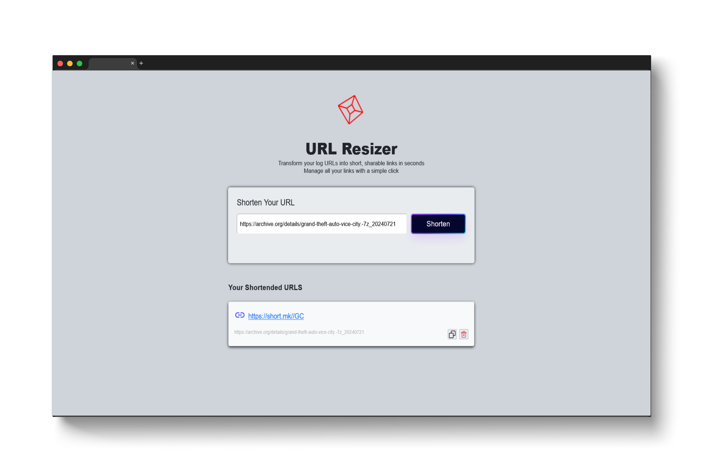

# Basic URL Shortener

A simple, self-contained URL shortener using a counter-based algorithm with Base62 encoding. No external dependencies—just HTML, CSS, and JavaScript.



## Features

- **Counter + Base62 Algorithm**: Generates short, unique codes (e.g., `1000` → `"G8"`).
- **No External Dependencies**: Pure client-side implementation.

## How It Works

1. **Encoding**:
   - Uses an incrementing counter (`1000`, `1001`, ...).
   - Converts numbers to Base62 (e.g., `1000` → `"G8"`).
2. **Storage**:
   - In-memory JavaScript object (resets on page refresh).
3. **Redirection**:
   - Visits to `https://short.mk/{code}` redirect to the original URL.

## Algorithm

```plaintext
1. Start counter at 1000.
2. For each URL:
   a. Increment counter.
   b. Convert counter to Base62 (0-9, A-Z, a-z).
   c. Store mapping: { code: longURL }.
3. Redirect /{code} → longURL.
